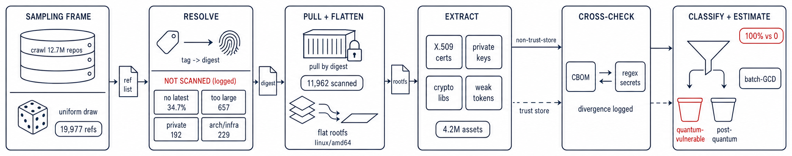

# CryptoCensus

[](https://github.com/CristhianKapelinski/cryptocensus/actions/workflows/artifact.yml)

**A reproducible, distributed census of the cryptographic posture and post-quantum
readiness of cryptographic files shipped in public container images.**

This repository is the research artifact for the paper *"CryptoCensus: Cryptographic
Posture and Post-Quantum Readiness of Docker Hub"*. CryptoCensus draws a sample in which
every Docker Hub repository has the same chance of selection, and pins each pullable
`latest` image by content digest, the hash of the exact image bytes, so a later run reads
the same image even after the tag moves. It extracts the certificates, keys, cryptographic
libraries, and weak TLS/SSH settings each image ships. It then classifies that material as
quantum-vulnerable (RSA and elliptic curve, which a large enough quantum computer breaks)
or post-quantum (the algorithms standardized in NIST FIPS 203/204/205). Across the measured
sample of **11,962 images and 4,211,380 public-key assets, 100% are quantum-vulnerable and
0% are post-quantum**, so the migration a NIST draft schedule would require by 2035 has not
started in these images. The artifact reproduces every quantitative claim in the paper from
the released dataset.

> **Paper:** *CryptoCensus: Cryptographic Posture and Post-Quantum Readiness of Docker Hub*, SBSeg 2026 (WTICG).
>
> **Abstract.** Under a draft schedule from the National Institute of Standards and
> Technology (NIST), affected systems would stop using Rivest-Shamir-Adleman (RSA) and
> elliptic-curve cryptography after 2035. Traffic recorded today can be decrypted once a
> sufficiently large quantum computer exists. How far published container images have moved
> toward standardized post-quantum algorithms has not been openly measured. CryptoCensus
> gives every repository in a 12,716,568-repository crawl the same chance of selection. We
> scan 11,962 images and catalog 4,211,380 certificates and key files. 100% are
> quantum-vulnerable and 0 are post-quantum. Although 801 images (about one in fifteen)
> include a library that supports post-quantum algorithms, none contains a post-quantum key
> or certificate. The images also contain weak cryptography. 43% of certificates outside
> trust-store paths use Secure Hash Algorithm 1 (SHA-1) or Message-Digest Algorithm 5 (MD5)
> signatures, 512-bit RSA keys remain, and 36 private keys in operational paths recur across
> distinct images. Docker Hub images have yet to begin their post-quantum transition, even
> where supporting libraries are installed.



## README structure

This README runs in the order below, from what the artifact is to how to reproduce the
paper's claim:

| Section | Description |
|---|---|
| Seals considered | Quality seals targeted by this artifact |
| Basic information | Hardware, OS, and software environment |
| Dependencies | Required packages and external tools |
| Security concerns | Risks and mitigations for evaluators |
| Installation | Step-by-step local setup |
| Minimal test | Quick functional verification (~1.5 min) |
| Experiments | Reproduction of the paper's main claim |
| License | Licensing information |
| How to cite | Paper reference and machine-readable `CITATION.cff` |

The repository is organized as follows:

| Path | Content |
|---|---|
| [`src/cryptocensus/`](src/cryptocensus/) | the pipeline, one module per concern: sampling, queue, worker, image acquisition, classification, analysis |
| [`src/cryptocensus/extractors/`](src/cryptocensus/extractors/) | one module per evidence source: certificates and keys, libraries, secrets, CBOM, SBOM |
| [`scripts/`](scripts/) | the reviewer's entry points: `minimal_test.sh`, `run_claim.sh`, `check_claim.py`, `reproduce_figures.py`, `reduced_census.sh`, `reproduce_from_scratch.sh` |
| [`config/`](config/) | the sampling frames: `sample-20000.txt` (the census) and `sample-images.txt` (the minimal test) |
| [`tests/`](tests/) | unit tests for the classifier, the batch-GCD pass, the certificate and key parser, and the aggregator |
| [`docs/`](docs/) | [`ARCHITECTURE.md`](docs/ARCHITECTURE.md) (design and threat model) and [`SUSTAINABILITY.md`](docs/SUSTAINABILITY.md) (code, dataset schema, and where each number is computed) |
| [`Dockerfile`](Dockerfile), [`pyproject.toml`](pyproject.toml), [`uv.lock`](uv.lock) | the single pinned image and the pinned dependency set |

The dataset is not in the repository. It is published as the `dataset-v1` release and
downloaded and checksum-verified by `run_claim.sh` on first use.

## Seals considered

The seals considered are **Available (SeloD)**, **Functional (SeloF)**, **Sustainable
(SeloS)**, and **Reproducible (SeloR)**.

- **Available (SeloD):** all source, the pinned [`Dockerfile`](Dockerfile), the sampling frames, and the docs are in this public repo under an open license.
- **Functional (SeloF):** unit tests plus [`scripts/minimal_test.sh`](scripts/minimal_test.sh) build and run the full pipeline end to end.
- **Sustainable (SeloS):** 23 modules, one concern each, every one with a docstring, every measurement decision a named function, and no hardcoded paths; [`docs/SUSTAINABILITY.md`](docs/SUSTAINABILITY.md) walks through the code, the dataset schema, and where each headline number is computed, and [`docs/ARCHITECTURE.md`](docs/ARCHITECTURE.md) documents the design.
- **Reproducible (SeloR):** [`scripts/run_claim.sh`](scripts/run_claim.sh) regenerates and asserts every headline number from the released dataset; [`scripts/reduced_census.sh`](scripts/reduced_census.sh) re-runs the live pipeline at small scale.

## Basic information (environment)

| | |
|---|---|
| **Hardware (paper census)** | commodity x86-64 hosts (8-core Intel i7-9700 · 32 GB RAM · Debian/Ubuntu) |
| **Minimum** | x86-64. Minimal test: 2 cores · 4 GB RAM. Claim #1 (`run_claim`): ~6.7 GB peak RAM measured (loads all records for batch-GCD), so **≥ 8 GB RAM** recommended; ~2 GB disk for the dataset archive |
| **OS** | Linux x86-64 (tested on Ubuntu 24.04 / Debian 12) |
| **Software** | Docker ≥ 24 (tested on 27.5; Compose v2 optional). Everything else (Python 3.12, `uv`, crane, the analyzer) runs inside the image; nothing is installed on the host. |
| **Host tools** | `curl`, `tar`, `sha256sum` (coreutils) for the one-time dataset download; `gh` optional (with a `curl` fallback) |
| **Network** | Docker Hub access for image pulls; anonymous pulls are rate-limited, a Docker Hub login raises the limit for the full census (not needed for the minimal test) |

## Dependencies

All third-party tools are pinned in the `Dockerfile` and run inside the image. On the host
the reproduction scripts need only Docker plus `curl`/`tar`/`sha256sum` for the one-time
download; nothing else is installed on the host.

| Tool | Version | Role |
|------|---------|------|
| crane (go-containerregistry) | 0.21.6 | daemonless pull + flatten |
| CBOM-Lens (OmniTrustILM) | 1.0.0 | independent CycloneDX-CBOM extractor (cross-check) |
| gitleaks | 8.30.1 | private-key recall |
| syft | 1.44.0 | crypto-library inventory (optional) |
| Python `cryptography` | ≥41 | certificate/key parsing (built-in instrument) |
| Redis | 7 | distributed task queue |
| uv (Astral) | 0.11.17 | dependency install during the image build |

## Security concerns

The artifact is **safe to run**. Sampled images are **pulled and flattened, never
executed**: `crane` exports the filesystem layers as data, so no untrusted code runs.
Extraction reads files inside an unpacked root filesystem in a scratch directory that is
removed after each image. No credentials are required for the minimal test; for the full
census a Docker Hub token may be supplied via the standard `~/.docker/config.json` and is
only used to authenticate pulls. The pipeline opens no inbound ports other than the Redis
queue you start.

## Installation

Everything runs through one Docker image, so this is the only required step:

```bash
git clone https://github.com/CristhianKapelinski/cryptocensus && cd cryptocensus
docker build -t cryptocensus:latest .        # single pinned image; all tools are inside it
```

This is the whole evaluator path: `uv` is not needed on the host, because it runs
inside the image.

For native development and unit tests only, install `uv` and let it create the
environment. Its installer places `uv` in `~/.local/bin`, which the current shell
picks up only after the `source` below or a new login shell:

```bash
curl -LsSf https://astral.sh/uv/install.sh | sh && . "$HOME/.local/bin/env"
uv sync --extra dev
uv run pytest -q
```

## Minimal test (≈ 1.5 minutes)

```bash
bash scripts/minimal_test.sh   # end-to-end (Docker): build → seed → work → collect → analyze
```

Measured **1m21s** on the test machine (AMD Ryzen 5 8600G) with the image already built from
*Installation*; a first run also builds the image (a few minutes).
[`minimal_test.sh`](scripts/minimal_test.sh) censuses the five images in
[`sample-images.txt`](config/sample-images.txt) (digest-pinned, so the result is
deterministic) and prints the report. Expected: **5/5 images scanned**, **1,171 public-key
assets**, **100% quantum-vulnerable, 0% post-quantum**, **3** of the 5 images shipping a
PQC-capable library, and CBOM-Lens running alongside the built-in extractor on all five
(`images for tool-divergence: 5`).

## Experiments

> # ⚠️ READ THIS BEFORE RUNNING ANY EXPERIMENT
>
> **You are expected to run ONE command, `scripts/run_claim.sh`. It reproduces the whole paper. Everything else on this page is optional.**
>
> - **Claim #1 is the only claim.** `scripts/run_claim.sh` takes **about 8 minutes** and checks every headline number against the paper.
> - **`reduced_census.sh` is optional** and exercises the live pipeline on 10 repositories, bounded by how fast Docker Hub serves those pulls. It is not needed for Claim #1.
> - **Do NOT run `reproduce_from_scratch.sh`.** It re-pulls the full 20,000-reference frame and Docker Hub's rate limit puts it at roughly **600 hours, about three to four weeks**, on one host. It exists to document how the dataset was built, not for evaluation.
> - **The minimal test needs no dataset** and finishes in about 1.5 minutes, so run it first if you only want to confirm the setup works.

We designate **one main claim** for reproduction: the paper's central result. One command
reproduces it from the released dataset and asserts every paper number.

### Claim #1: cryptographic files in the sampled images show no post-quantum migration

Paper: Abstract, Table 2, Section *Post-quantum readiness*.

```bash
scripts/run_claim.sh
```

Downloads and verifies `dataset-v1` (if absent), re-runs the analyzer, regenerates the three
figures, and checks every headline number against the paper. **7m27s to 8m00s across runs;
~6.7 GB peak RAM** measured on an AMD Ryzen 5 8600G (6 cores/12 threads), download excluded;
single-threaded
(the analyzer loads all records for the batch-GCD pass over 6,116 moduli, which dominates both
time and memory), no GPU. Numbers reproduce **exactly**, because the pipeline uses no randomness and
`dataset/run_manifest.csv` pins every image by digest.

**Expected result**, one `OK` per metric, ending in `RESULT: OK`:

```
  Claim: sampled cryptographic files show no post-quantum migration
  PQC-capable images  : 801 / 11,962  (6.7%, 95% CI 6.3-7.2)
  Post-quantum assets : 0 / 4,211,380  (100% quantum-vulnerable)
  Weak-signature certs: 43.0%
  RSA keys < 2048-bit : 40,720  (5,552 at 512-bit)
  Reused fingerprints : 2,412 of 7,141
  RSA moduli / factorable (batch-GCD): 6,116 / 4
  Unresolved (no latest tag): 34.7%
  ─────────────────────────────────────────────
  images_ok  11,962 | public_key_assets  4,211,380 | pqc_capable_images  801
  certs_non_trust_store  518,668 | weak_sig_pct  43 | rsa_sub2048  40,720 | ... every row OK
  RESULT: OK  - matches Table 2 of the paper
```

The regenerated paper figures land in `dataset/` next to `summary.json`. Open them with
e.g. `xdg-open dataset/fig_posture.pdf` (also `fig_repro.pdf` and `fig_keys.pdf`).

### Optional: re-run the census live

Not required for Claim #1. [`scripts/reduced_census.sh`](scripts/reduced_census.sh) runs
the whole pipeline live on a single host, no Docker Hub login, over a few repositories
drawn from the frame (default 10, configurable):

```bash
bash scripts/reduced_census.sh        # 10 repositories
bash scripts/reduced_census.sh 25     # N repositories
```

It starts Redis and one worker, seeds the draw, pulls and flattens each image with
`crane`, extracts, and analyzes into `dataset-reduced/summary.json`.

To rebuild the full 20,000-reference dataset, [`scripts/reproduce_from_scratch.sh`](scripts/reproduce_from_scratch.sh)
re-pulls every image in [`sample-20000.txt`](config/sample-20000.txt) by digest. On a
single host this is bound by Docker Hub's pull limit (~200 images per 6 h per IP), so the
full frame takes roughly `20,000 / 200 * 6 h ≈ 600 h` (about **three to four weeks**); the
original census parallelized the queue across several hosts (distinct IPs) to finish
sooner. This is why the released dataset (Mode A above) is the canonical reproduction and
`reduced_census.sh` exists to exercise the live pipeline in minutes.

All behaviour is `CC_*`-configured; the full config reference, the sampling-frame
construction, and the measurement's limitations are in
[`docs/ARCHITECTURE.md`](docs/ARCHITECTURE.md).

## License

MIT, see [LICENSE](LICENSE).

## How to cite

Cite the paper, not the repository:

> Kapelinski, C. and Kreutz, D. (2026). CryptoCensus: Cryptographic Posture and Post-Quantum Readiness of Docker Hub. In *Anais do XXVII Simpósio Brasileiro de Segurança da Informação e de Sistemas Computacionais (SBSeg 2026), Workshop de Trabalhos de Iniciação Científica e de Graduação (WTICG)*. Sociedade Brasileira de Computação.

```bibtex
@inproceedings{kapelinski2026cryptocensus,
  author    = {Kapelinski, Cristhian and Kreutz, Diego},
  title     = {CryptoCensus: Cryptographic Posture and Post-Quantum Readiness of Docker Hub},
  booktitle = {Anais do XXVII Simpósio Brasileiro de Segurança da Informação e de Sistemas Computacionais (SBSeg 2026), Workshop de Trabalhos de Iniciação Científica e de Graduação (WTICG)},
  year      = {2026},
  publisher = {Sociedade Brasileira de Computação},
}
```

[`CITATION.cff`](CITATION.cff) carries the same metadata in machine-readable form, so GitHub's
"Cite this repository" button and tools such as Zenodo pick it up automatically.
